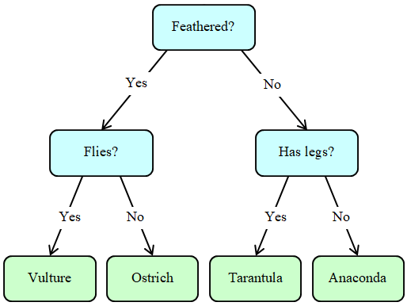
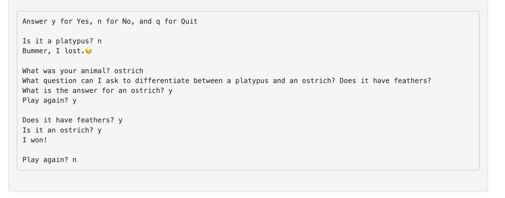

# Expert Systems vs Neural Networks
This is a repository for my work on the LiveProject for Manning Publicatons, which I am beta testing.  Manning offers some of the best live projects with mentoring support on the project.  Check them out here at [Manning Publications](https://manning.com) 

## Objective Milestone 1: Animal Map Game

In this milestone, you’ll build the Animal Game, a silly little text-based game similar to 20 Questions. You think of an animal, and the computer uses yes/no questions to try to guess the animal.

For this milestone, you’ll do the following:

Build the AnimalNode class used to hold the program’s knowledgebase

Update the knowledgebase so the program learns over time

### Background

Some form of the animal game has been around since at least 1975, so this is hardly cutting-edge software, but it does have a few useful lessons to teach. (Plus, it’s a fun program to write and use!) The fact that the program uses yes/no questions lets you easily map the knowledgebase to a binary tree structure. Each internal node in the tree represents a question. If the user answers “y” (for “yes”), you move down the node’s left branch to another question or a guess. If the user answers “n” (for “no”), you move down the right branch. If the user answers “q” (for “quit”), the program ends.

One round of the game looks like:

### Code
  